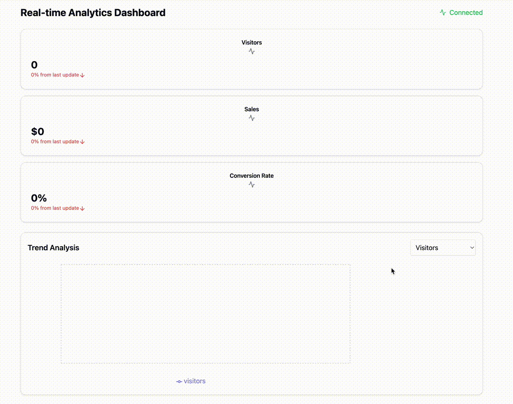

# TypeScript + React + Vite Project

## Tech Stack

- TypeScript 5
- React 18
- Vite 4
- React Testing Library 8

## Common Commands

- `make init`
  - build the project
- `make verify`
  - run tests
- `make run`
  - start the server

## Implementation

### Technical Details

- Uses useState and useEffect for state management
- Implements simulated WebSocket updates (can be replaced with real WebSocket)
- Responsive design using Tailwind CSS
- Data visualization using Recharts
- Uses shadcn/ui components for consistent styling

