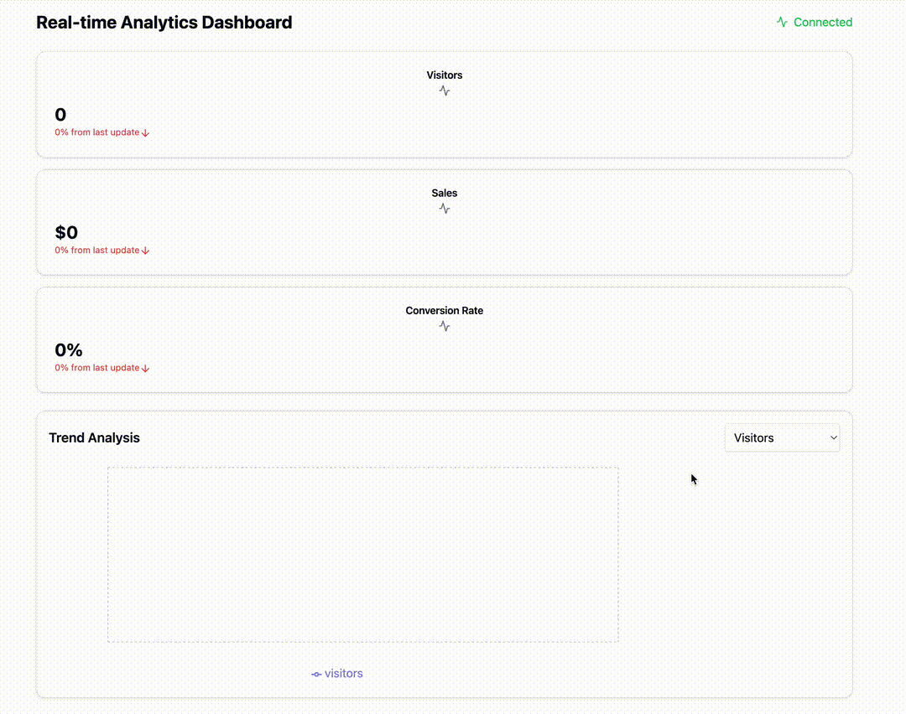

# Interview Questions

You'll create a focused version of a real-time dashboard that's feasible to implement in 3-4 hours. This version will demonstrate key React skills while remaining manageable in scope.

This 3-4 hour task focuses on these key areas:

1. Core Features:
   - Real-time data visualization with automatic updates
   - Multiple metric displays (visitors, sales, conversion rate)
   - Interactive line chart with metric selection
   - Connection status indicator
   - Percentage change calculations

2. Technical Implementation Details:
   - Uses useState and useEffect for state management
   - Implements simulated WebSocket updates (can be replaced with real WebSocket)
   - Responsive design using Tailwind CSS
   - Data visualization using Recharts
   - Uses shadcn/ui components for consistent styling

3. What to Look For in Candidates:
   - Understanding of React hooks and component lifecycle
   - State management approach
   - Error handling and edge cases
   - Code organization and reusability
   - Performance considerations
   - UI/UX decisions

4. Possible Extensions (if time permits):
   - Add error boundary
   - Implement data export
   - Add more chart types
   - Add date range selection
   - Implement real WebSocket connection

5. Bonus Points:
   - Utilized useContext for state management, allowing for a more efficient way to share data across components without prop drilling.
   - Implemented theme switching functionality, enabling users to change the application's theme dynamically, enhancing user experience and accessibility.

Interview Assessment Points:

1. Code Structure:
   - Component organization
   - Hook usage
   - Props and state management

2. Technical Skills:
   - React fundamentals
   - Real-time data handling
   - Chart implementation
   - Responsive design

3. Problem Solving:
   - Data transformation
   - Error handling
   - Performance optimization

